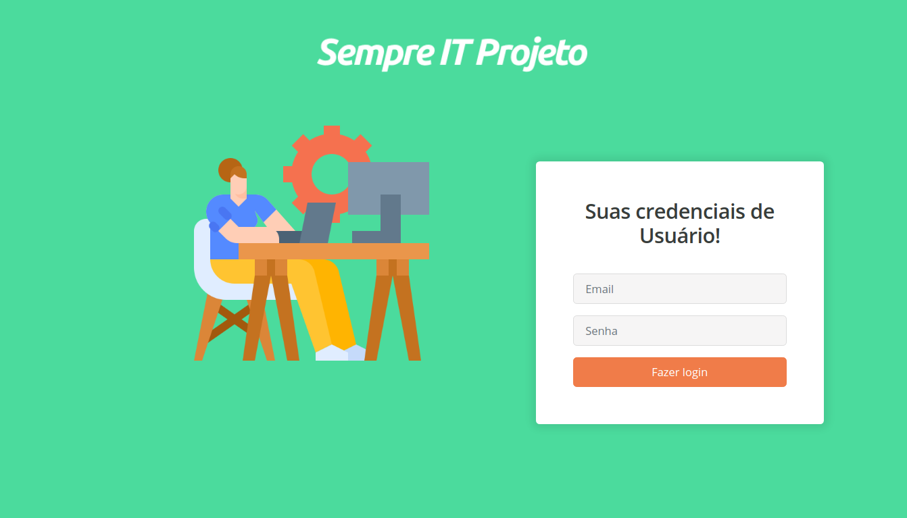

<h1 align="center">
    
</h1>

<h4 align="center">
	:heavy_check_mark:  Sempre IT projeto Fullstack 🚀 Concluído! :heavy_check_mark:
</h4>
<p align="center">
  
</p>

<p align="center">
<a href="https://insomnia.rest/run/?label=NLW%201.0%20-%20Ecoleta&uri=https%3A%2F%2Fraw.githubusercontent.com%2FDanielObara%2FNLW-1.0%2Fmaster%2Fbackend%2FInsomnia.json" target="_blank"></a>
</p>
<p align="center">
  <a href="#-sobre-o-projeto">Sobre o projeto</a>&nbsp;&nbsp;&nbsp;|&nbsp;&nbsp;&nbsp;
  <a href="#-objetivo">Objetivo</a>&nbsp;&nbsp;&nbsp;|&nbsp;&nbsp;&nbsp;
  <a href="#tecnologias">Tecnologias</a>&nbsp;&nbsp;&nbsp;|&nbsp;&nbsp;&nbsp;
  <a href="#-como-usar">Como usar</a>&nbsp;&nbsp;&nbsp;|&nbsp;&nbsp;&nbsp;
</p>

## :information_source: Sobre o Projeto

PROJETO desenvolvido especialmente para a SEMPRE IT. Apliacação para controle de gestão de produtos, CRUD básico. Adicionei também um filtro nas tabelas, porém um filtro totalmente do lado do cliente, sem precisar consultar no banco de dados, apenas retorna os dados em tela, para isso utilizei alguns parâmetros para realizar a busca, e a biblioteca para tal foi a AntDesign.

## 💻 Objetivo

O projeto consiste em ter um controle e gerenciamento de produtos. Crud de listar, inserir, editar, deletar produtos. Também funciona com autenticação assinada via token. Sendo assim provemos dois tipos de usuários. Para tal usei também o Private Route para privar rotas e autorizar a entrada delas apenas com dados repassados ao storage da apliacação.

<h1 align="center">
    
</h1>

## :rocket: Tecnologias

O projeto foi desenvolvido com as seguintes tecnologias e depêndencias:

## :computer: Frontend:

- [Javascript][javascript]
- [React.js][reactjs]
- [AntDesign][antdesign]
- [Reactstrap][reactstrap]
- [Yarn][yarn]
- [Pubsub-js][pubsub-js]
- [React Highlight Words][react-highlight-words]
- [React Router Dom][react-router-dom]
- [Axios][axios]

## :computer: Backend:

- [Node.js][nodejs]
- [Express][nodejs]
- [Mysql][nodejs]
- [Bcrypt][nodejs]
- [Body-parser][nodejs]
- [Cors][nodejs]
- [Jsonwebtoken][nodejs]
- [Knex][nodejs]

## :information_source: Como usar

Clone a aplicação com o git clone, siga os passos abaixo:

Em seu terminal na linha de comando:

### Instale a API Backend

```bash
# Clone o repositório principal
$ git clone https://github.com/JulioCesar012/projetoSempreIT.git

# Vá para a pasta backend
$ cd projetoSempreIT/backend

# Instale as dependências
$ yarn install
      ou
$ npm install

# Rode as Migrações
$ yarn knex migrate:latest

# Inicie o servidor
$ yarn start

# rodando na porta padrão: 3333
```

### Instale o Front-end

```bash
# Clone o repositório (se já clonou pule para o próximo passo)
$ git clone https://github.com/JulioCesar012/projetoSempreIT.git

# Vá para a pasta frontend
$ cd projetoSempreIT/frontend

# Instale as dependências
$ yarn install
      ou
$ npm install

# Inicie
$ yarn start

# rodando na porta 3000
```

- Observação: No projeto usei localmente xampp na sua última versão com o servidor mysql e apache rodando em minha máquina, para local, é recomendado usar o xampp e configurar seu database no arquivo knexfile.js e no connectionDBMysql. Usei Linux que é meu sistema operacional preferido.

## :rocket: Testar Online

O projeto foi hospedado em servidor heroku tanto frontend como backend, e o banco de dados mysql sendo utilizado direto das hospedagem 000webhost, clique no link abaixo:

- [Frontend][frontend]

Desenvolvido com ♥ por @JulioCesar012 :wave: [Me contate!](https://www.linkedin.com/in/julio-cesar-filho-759653171/)

[nodejs]: https://nodejs.org/
[javascript]: https://developer.mozilla.org/pt-BR/docs/Web/JavaScript
[reactjs]: https://reactjs.org
[antdesign]: https://ant.design/
[reactstrap]: https://reactstrap.github.io/
[yarn]: https://yarnpkg.com/
[pubsub-js]: https://www.npmjs.com/package/pubsub-js
[react-highlight-words]: https://www.npmjs.com/package/react-highlight-words
[react-router-dom]: https://reactrouter.com/web/guides/quick-start
[axios]: https://github.com/axios/axios
[express]: https://expressjs.com/pt-br/
[mysql]: https://www.mysql.com/
[bcrypt]: https://www.npmjs.com/package/bcryptjs
[body-parser]: https://www.npmjs.com/package/body-parser
[cors]: https://developer.mozilla.org/pt-BR/docs/Web/HTTP/Controle_Acesso_CORS
[jsonwebtoken]: https://jwt.io/
[knex]: http://knexjs.org/
[frontend]: https://github.com/axios/axios
